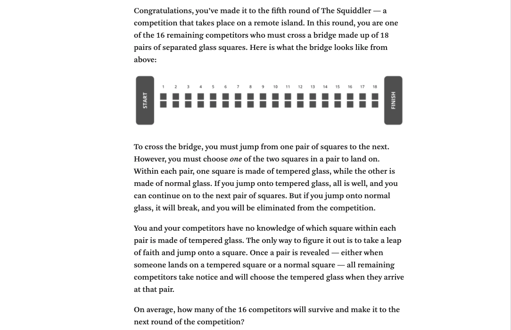

Glass Stepping Stones
================

From [Zach Wissner-Gross](https://twitter.com/xaqwg) and [The
Riddler](https://fivethirtyeight.com/features/can-you-survive-squid-game-riddler/):

## Solution:

I’ve taken a simulation-based approach to estimating the number of
survivors. My code can be found in `squid_game.R` and in the
`README.Rmd` file that produced what you’re reading now.

**(Spoiler Alert)**

In this episode, some of the players are fortunate enough to have a
former glass factory worker posit his guesses before they do, taking his
leaps based on the optical and acoustic differences between tempered and
normal glass.

In these simulations, I’ve assumed the glassmaker’s judgments to be
infallible - he, and thus and all players behind him, will survive with
100% probability. However, his placement in the order of players is
random.

Below are the results of my simulation with, and without, the help of
this player.

### Probabilities that **x** players survive:

### Cumulative probability that at least **x** survive:

